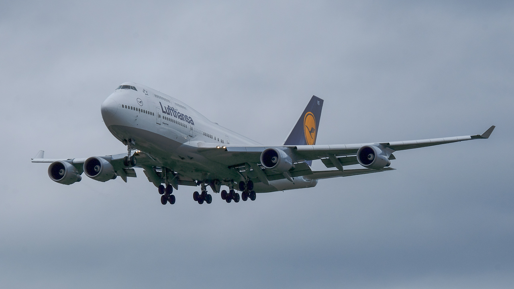

# Build a Serverless Machine Learning Bot

## Overview
In this tutorial, you will build a serverless bot using Slack and Amazon Web Services, including AWS Lambda, Amazon SageMaker, SQS, and API Gateway. The bot will help you classify commercial aircraft found in images. 
### Objectives
In this tutorial you will perform the following tasks:

* **[Create an aircraft classifier](AircraftClassifier)** -
In this lab you will use Amazon SageMaker to train an aircraft classification model and then create an AWS Lambda function to act as a private interface for your Amazon SageMaker endpoint.
* **[Lab 2: Build an aircraft detector](lab2)** -
In this lab you will use Amazon Rekognition to detect aircraft and create and AWS Lambda function to interact with Rekognition.
* **[Lab 3: Create a request handler](lab3)** -
In this lab you will use AWS Lambda and SQS to queue and process classification requests
* **[Lab 3: Build a public interface](lab4)** -
In this lab you will use Amazon API Gateway and AWS Lambda to create a public interface for your aircraft classifier
* **[Lab 5: Build a Slack bot](lab5)** -
In this lab you will create a Slack bot that allows you to send request to your aircraft classify
* **[Lab 6: Cleanup](lab6)** - 
In this lab you will tear down all AWS resources created during this tutorial.

### Prerequisites
* AWS account
* Slack account

_**Note:** For this tutorial you will be creating and using AWS resources including Amazon S3, SageMaker, Lambda, SQS, and API Gateway. All AWS resources must be created in the same AWS region._

_For an up-to-date list of services and supported regions, see https://docs.aws.amazon.com/general/latest/gr/rande.html_
