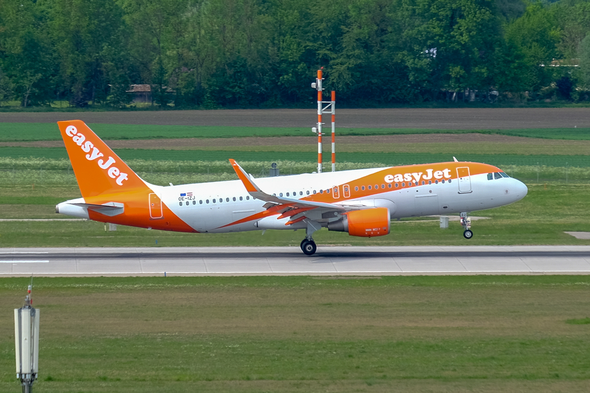

# Build a Machine Learning Enabled Bot using Amazon Web Services

## Overview
In this tutorial, you will build a an aircraft classification bot using Slack and Amazon Web Services, including AWS Lambda, Amazon SageMaker, and API Gateway.
### Objectives
In this tutorial you will perform the following tasks:

* **[Lab 1: Train an aircraft classifier](lab1)** -
In this lab you will use Amazon SageMaker to train an aircraft classifier.
* **[Lab 2: Create a private interface](lab2)** -
In this lab you will use AWS Lambda to create a private interface for your Amazon SageMaker endpoint
* **[Lab 3: Build a public interface](lab3)** -
In this lab you will use Amazon API Gateway and AWS Lambda to create a public interface for your aircraft classifier
* **[Lab 4: Build a Slack bot](lab4)** -
In this lab you will create a Slack bot that allows you to send request to your aircraft classify
* **[Lab 5: Cleanup](lab5)** - 
In this lab you will tear down all AWS resources created during this tutorial.

### Prerequisites
* AWS account
* Slack account

_**Note:** For this tutorial you will be creating and using AWS resources including Amazon S3, SageMaker, Lambda, and API Gateway. All AWS resources must be created in the same AWS region._

_Amazon SageMaker is currently available in the following regions: US East (Ohio), US East (N. Virginia), US West (Oregon), Asia Pacific (Seoul), Asia Pacific (Sydney), Asia Pacific (Tokyo), EU (Frankfurt), EU (Ireland), and AWS GovCloud (US)._

_For an up-to-date list of services and supported regions, see https://docs.aws.amazon.com/general/latest/gr/rande.html_
