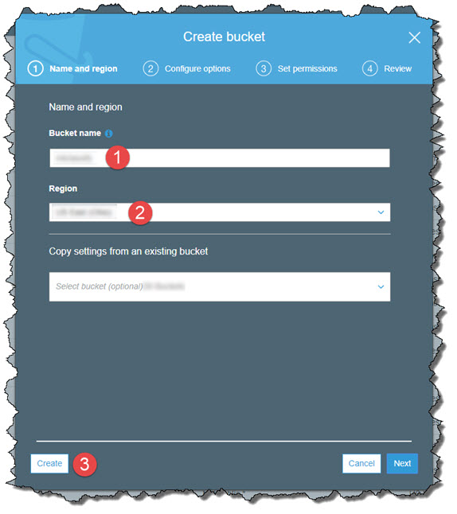
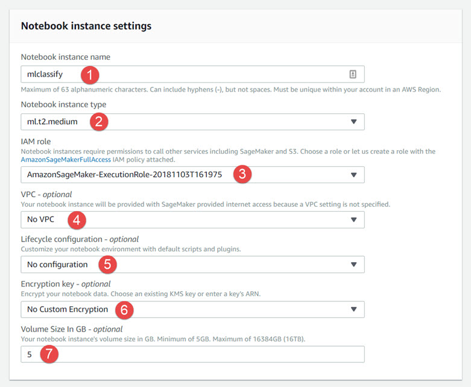
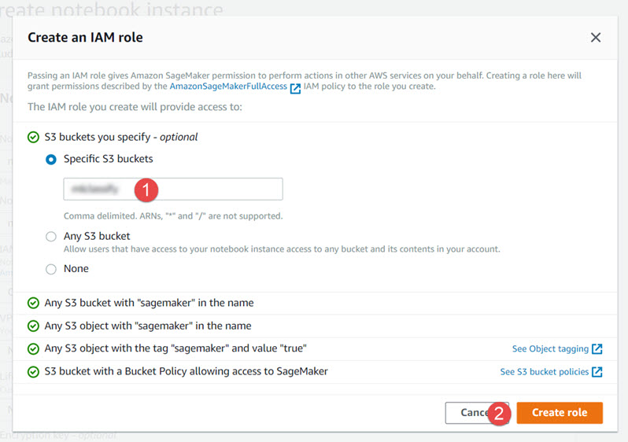
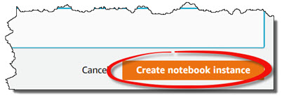
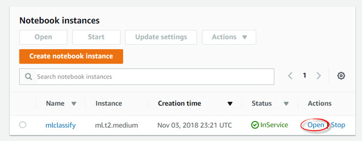
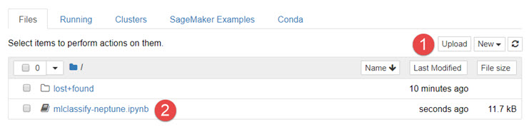
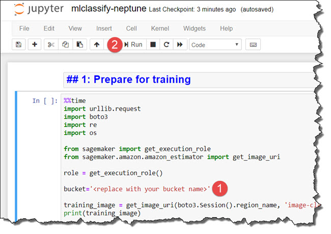
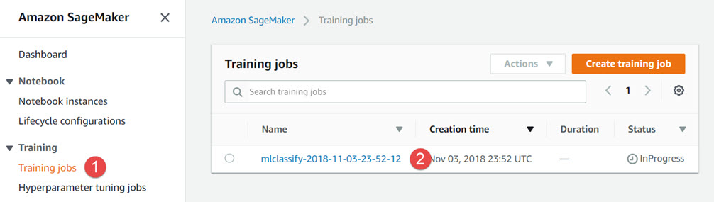
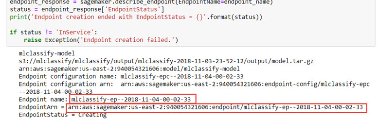

# Lab 1: Train an aircraft classifier
In this lab you will use Amazon SageMaker and Amazon Lambda to build a system to classify single aircraft in an image.

## Task 1: Create an S3 bucket
The S3 bucket will be used to store training images for the SageMaker model and the model artifacts
1. Browse to the Amazon S3 console to create a new bucket: https://console.aws.amazon.com/s3/home#/create
2. Click on the **Create Bucket** button and enter the following information
* Bucket name: a unique, DNS compliant bucket name.
* Region: The same region as your AWS Lambda and Amazon API Gateway resources

<p align="center"></p>

3. Click on the **Create** button to finish.

## Task 2: Create a SageMaker Notebook
1. Browse to the Amazon SageMaker console to create a new notebook: https://console.aws.amazon.com/sagemaker/home#/notebook-instances/create
2. Enter the following information for your notebook:
* Notebook instance name: **mlclassify**
* Notebook instance type: **ml.t2.medium**
* IAM role: **Create a new role**
* VPC: **No VPC**
* Lifecycle configuration: **No configuration**
* Encryption key: **No Custom Encryption**
* Volume Size in GB: **5**

<p align="center"></p>

3. When prompted to create an IAM role, enter the name of the S3 bucket create in the previous task, then click the **Create role** button to continue.

<p align="center"></p>

4. Click on the **Create notebook instance** button to finish

<p align="center"></p>

5. Wait for your notebook status to change to **InService**, then click the **Open** link. This will open Jupyter notebook in another tab.

<p align="center"></p>

6. Load the Jupyter notebook for this lab by clicking the **Upload** button and providing the file to use: https://s3-us-west-2.amazonaws.com/awsgeek-devweek-austin/mlclassify-neptune.ipynb

<p align="center"></p>

7. Click in the uploaded notebook name to finish

# Task 3. Train the SageMaker model
Execute the following steps in order to train your model
1. Prepare for training. Replace ```<replace with your bucket name>``` with the bucket name you created in a previous task, then click on the **Run** button to run this cell of the notebook.

<p align="center"></p>

2. Train the model. Select this cell, then click on the **Run** button to train the model. Training this model takes approximatley 5 to 10 minutes. 

3. While waiting for the training job to finish, browse to the SageMaker console and find training job. Click on the training job and open to view details and log activity.

<p align="center"></p>

4. Deploy the model. Select this cell, then click on the **Run** button to deploy the model. Deploying this model can take several minutes. Capture the endpoint name and ARN for later use:

<p align="center"></p>

5. Finally, Test the model. Select this cell, then click on the **Run** button to test the model. Verify the classification matches the displayed aircraft.

## This is the end of the lab
