# Lab 2: Create a private interface
In this lab you will use AWS Lambda to create a private interface to Rekognition for aircraft detection

## Task 1: Create a Lambda function
Create an AWS Lambda function that uses Amazon SageMaker to classify an aircraft in an image
1. Browse to the AWS Lambda console to create a new function: https://console.aws.amazon.com/lambda/home#/create
2. Select the **Author from Scratch** option:

<p align="center">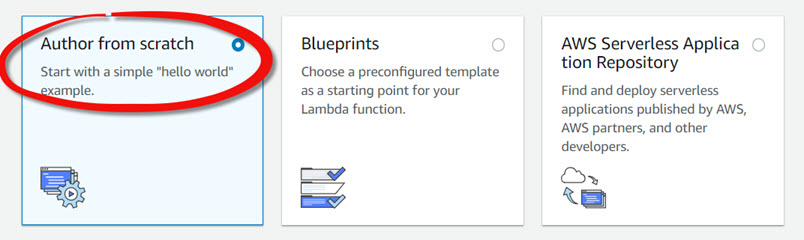</p>

3. Fill out the following information for the Lambda function:
* Name: **mlbot-detect**
* Runtime: **Python 3.7**
* Role: **Create a custom role**

<p align="center">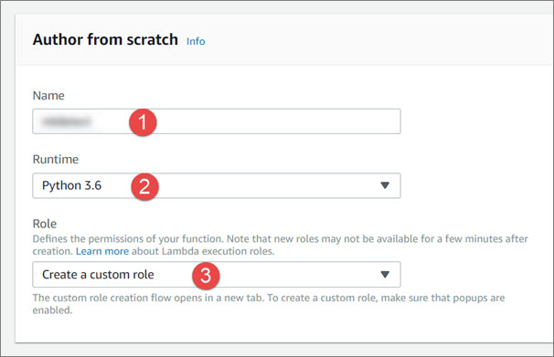</p>

4. Specify the following information for the IAM role, then click the **Allow** button to continue:
* IAM Role: **Create a new IAM Role**
* Role Name: **mlbot-detect**

<p align="center">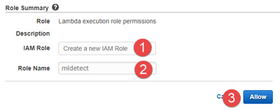</p>

5. Click the **Create** function' button to finish:

<p align="center">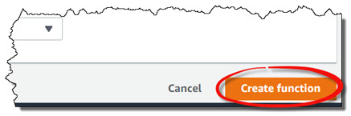</p>

## Task 2: Update the IAM role
Update the IAM role to allow invocation of the SageMaker InvokeEndpoint API
1. Browse to the AWS IAM console to edit the **mlbot-detect** IAM role: https://console.aws.amazon.com/iam/home#/roles/mlbot-detect
2. Click on the **Add inline policy** button

<p align="center">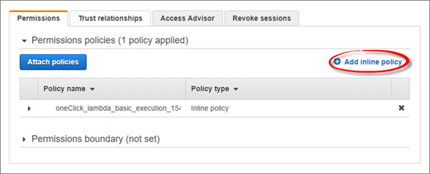</p>

3. Click on the **JSON** tab and replace the existing policy with the following. Replace ```<S3 bucket name>``` with the name of your S3 bucket.

```
{
    "Version": "2012-10-17",
    "Statement": [
        {
            "Sid": "mlbot-detect-rek",
            "Effect": "Allow",
            "Action": "rekognition:DetectLabels",
            "Resource": "*"
        },
        {
            "Sid": "mlbot-detect-s3",
            "Effect": "Allow",
            "Action": "s3:GetObject",
            "Resource": "arn:aws:s3:::<S3 bucket name>/*"
        }
    ]
}
```
4. Click on the **Review policy** button to continue

<p align="center">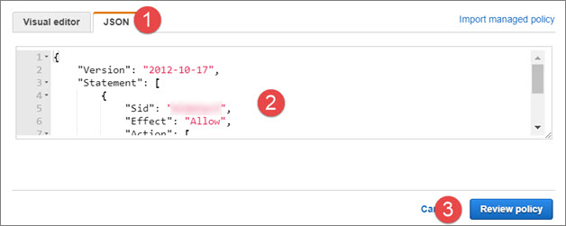</p>

5. Name the policy **mlbot-detect**, then click on the **Create policy** button to finish

<p align="center">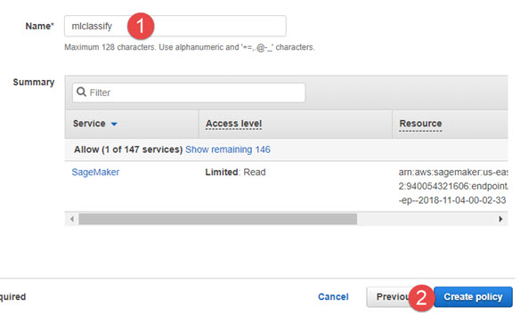</p>

## Task 3: Update the Lambda function
Update the Lambda Function classify an aircraft in an image using Amazon SageMaker InvokeEndpoint API
1. Browse to the AWS Lambda console to edit the **mlclassify** Lamda function: https://console.aws.amazon.com/lambda/home#/functions/mlbot-detect
```
import boto3
from botocore.vendored import requests

rek = boto3.client('rekognition')

def lambda_handler(event, context):
    
    # Location of the input image
    if 'url' in event:
        url = event['url']
        bytes = requests.get(url).content
        image = {'Bytes': bytes}
    else:
        bucket = event['bucket']
        key = event['key']
        image = {"S3Object": { "Bucket": bucket, "Name": key}}
    
    # Label(s) to look for
    labels = event['labels']
    labels = labels.split(",")

    results = []
    try:
        
      response = rek.detect_labels( Image = image )

      for label in response['Labels']:
        if label['Name'] in labels:
          for instance in label['Instances']:

            results.append( { 
                'label' : label['Name'],
                'score' : instance['Confidence'],
                'left'  : instance['BoundingBox']['Left'],
                'top'  : instance['BoundingBox']['Top'],
                'width'  : instance['BoundingBox']['Width'],
                'height'  : instance['BoundingBox']['Height']
            })

    except Exception as e:
      print(e)

     
    return results
```
3. Click the **Save** button to finish

<p align="center">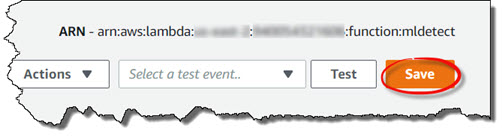</p>

## Task 4: Test the Lambda function
Create a test event and test your Lambda function 
1. Browse to the AWS Lambda console to edit the **mlbot-detect** Lamda function: https://console.aws.amazon.com/lambda/home#/functions/mlclassify
2. Click on the **Select a test event..** drop down and select **Configure test events**

<p align="center">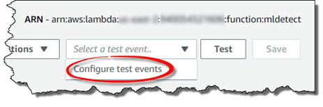</p>

3. Specify the following onformation for the test event:
* Event template: **Hello World**
* Event name: **mlbot-detect-detect**
* Code:
```
{
  "url": "https://s3-us-west-2.amazonaws.com/awsgeek-mlbot-pdx/boeing-747.jpg"
}
```

<p align="center">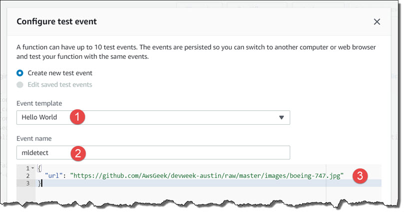</p>

4. Click on the **Create** button to continue

<p align="center">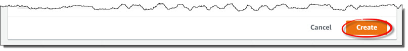</p>

5. Click click on the **Test** button, then verify the output of the test matches the example output below

<p align="center">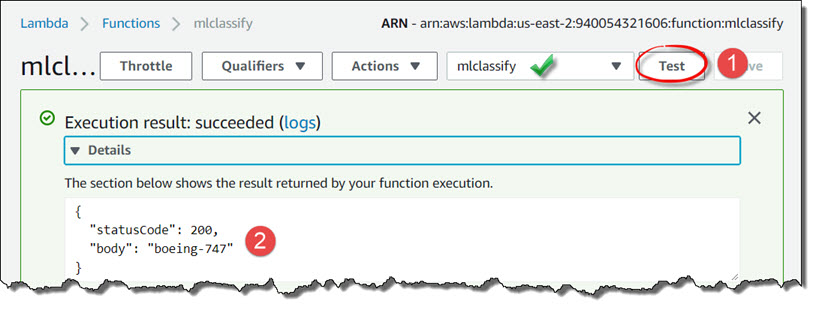</p>

## This is the end of the lab
