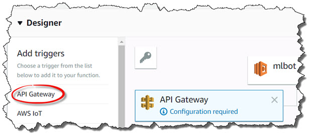
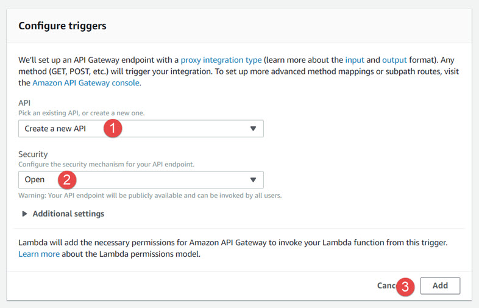
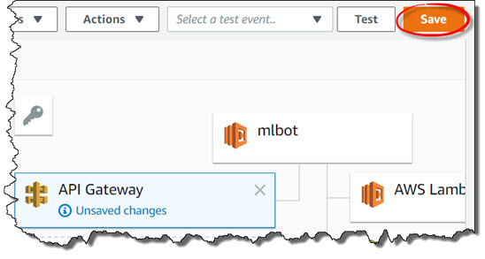
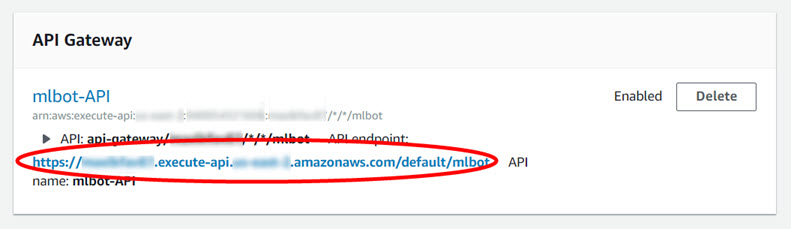

# Lab 3: Build the request handler
In this lab you will use an SQS queue and Lambda function to handle incoming requests.

## Task 1: Create a Lambda function
Create an AWS Lambda function that coordinates detection and classification of aircraft in images.
1. Browse to the AWS Lambda console to create a new function: https://console.aws.amazon.com/lambda/home#/create
2. Select the **Author from Scratch** option:
3. Fill out the following information for the Lambda function:
* Name: **mlbot-handler**
* Runtime: **Python 3.7**
* Role: **Create a custom role**
4. Specify the following information for the IAM role, then click the **Allow** button to continue:
* IAM Role: **Create a new IAM Role**
* Role Name: **mlbot-handler**
5. Click the **Create** function' button to finish:

## Task 2: Update the IAM role
Update the IAM role to allow invocation of the **mlbot-detect** and **mlbot-classify** Lambda functions
1. Browse to the AWS IAM console to edit the **mlbot-handler** IAM role: https://console.aws.amazon.com/iam/home#/roles/mlbot-handler
2. Click on the **Add inline policy** button
3. Click on the **JSON** tab and replace the existing policy with the following. Include the ARNs of your **mlbot-detect** and **mlbot-classify** Lambda functions:

```
{
    "Version": "2012-10-17",
    "Statement": [
        {
            "Sid" : "mlbot",
            "Effect": "Allow",
            "Action": "lambda:InvokeFunction",
            "Resource": [
                "<mlbot-detect Function ARN>",
                "<mlbot-classify Function ARN>",
            ]
        }
    ]
}
```
4. Click on the **Review policy** button to continue
5. Name the policy **mlbot-handler**, then click on the **Create policy** button to finish

## Task 3: Update the Lambda function
Your aircraft detector will ultimately respond with one of several message:
1. There is no aircraft in the image
2. There are too many aircraft in the image
3. There is an unknown aircraft in the image
4. There is a <aircraft type> in the image
    
Let's add the code to the Lambda function to 

Add boilerplate code to respond correctly when Slack verifies your endpoint 
1. Browse to the AWS Lambda console to edit the **mlbot** Lambda function: https://console.aws.amazon.com/lambda/home#/functions/mlbot
2. Replace the **lambda_function.py** template code with the following ([mlbot-lambda.py](mlbot-lambda.py)):
```
import json
 
def response(code, body):
    return {
        'statusCode': str(code),
        'body': body,
        'headers': { 'Content-Type': 'application/json'}
    }
 
def success(res=None):
    return response(200, json.dumps(res))
 
def failure(err):
    return response(400, err.message)
 
def lambda_handler(event, context):
 
    params = json.loads(event['body'])
    if params['type'] == "url_verification":
        return success({'challenge': params['challenge']})
        
    return failure(Exception('Invalid event type: %s' % (params['type'])))
```
3. Click the **Save** button to finish

<p align="center"></p>

## Task 4: Create an API Gateway
Expose a publicc interface for your Lambda function
1. Browse to the AWS Lambda console to edit the **mlbot** Lambda function: https://console.aws.amazon.com/lambda/home#/functions/mlbot
2. Click on **API Gateway** in the **Add triggers** section

<p align="center"></p>

3. Configure the API Gateway trigger as follows, then click on the **Add** button to continue
* Pick an existing API, or create a new one: **Create a new API**
* Security: **Open**

<p align="center"></p>

4. Click the ‘Save’ button to finish

<p align="center"></p>

5. When complete, copy the API endpoint value for use in the next lab

<p align="center"></p>

## This is the end of the lab
