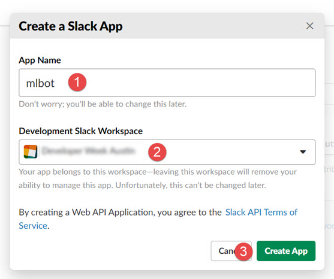
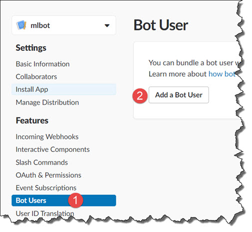
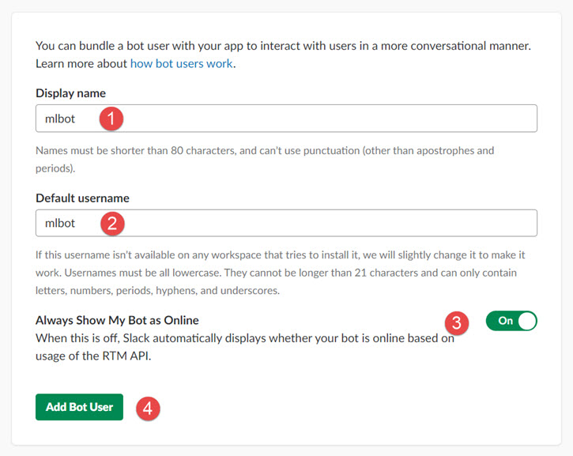
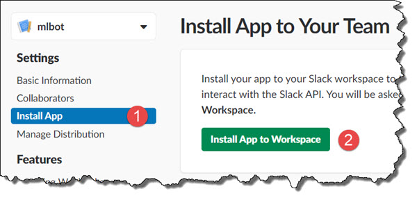
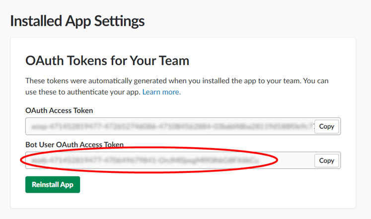
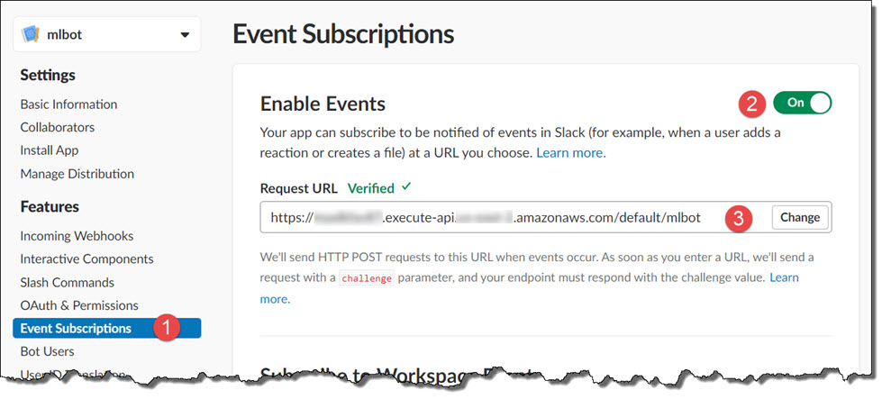
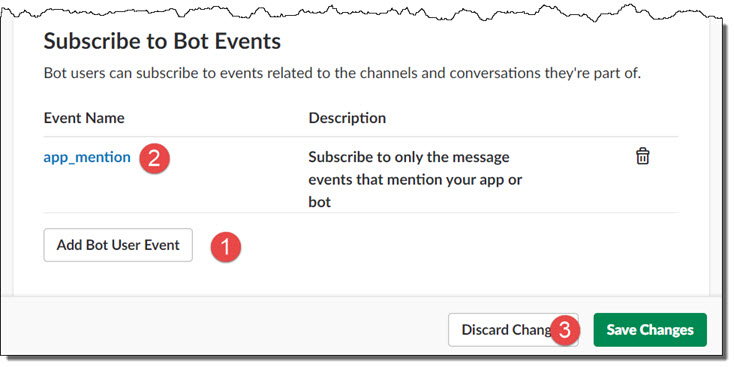
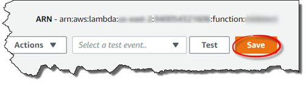
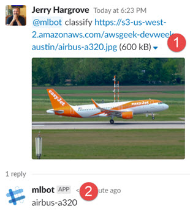

# Lab 4: Build a Slack bot
In this lab you will create a Slack bot that allows you to send requests to your object detector

## Task 1: Create a Slack app
1. Navigate to https://api.slack.com/apps?new_app=1, login to your workspace if necessary.
2. Create a new Slackk app named **mlbot**, select your workspace, then click the **Create App** button to continue

<p align="center"></p>

3. In the **Features** section, select **Bot Users**, then click the **Add Bot User** button. 

<p align="center"></p>

4. Specify the following information for your bot user, then click the **Add Bot User** button to continue:
* Display name: **mlbot**
* Default username: **mlbot**
* Always Show My Bot as Online: **On**

<p align="center"></p>

5. In the **Settings** section, select **Install App**, then click the **Install App to Workspace** button. Follow the instructions to authorize the installation and use of your new app. 

<p align="center"></p>

6. Copy the **Bot User OAuth Access Token** to finish. This will be required in the next lab

<p align="center"></p>

## Task 2: Create an event subscription  
1. In the **Features** section, select **Event Subscriptions**, then click the **Enable Events** switch. 
2. For the **Request URL**, specify the API Gateway endpoint URL you captured in the previous lab. 

<p align="center"></p>

The Request URL will show **Verified** if Slack can successfully reach your mlbot Lambda function via the API Gateway

3. In the **Subscribe to Bot Events** section, click on the **Add Bot User Event** button, then select the **app_mentions** event type. Click in the **Save Changes** button to finish.

<p align="center"></p>

## Task 3: Update the Lambda function
Add code to the **mlbot** funtion to parse and dispatch incomoing requests from your Slack bot. 
1. Browse to the AWS Lambda console to edit the **mlbot** Lambda function: https://console.aws.amazon.com/lambda/home#/functions/mlbot
2. Replace the **lambda_function.py** template code with the following ([mlbot-lambda.py](mlbot-lambda.py)). In addition, replace:

* **```<mldetect function ARN>```** with the ARN of your **mlclassify** Lambda function catptured in a previous lab
* **```<Bot User OAuth Access Token>```** with the token captured earlier in this lab
```
import boto3
import json
import re
from botocore.vendored import requests

session = boto3.session.Session()
lmbda = session.client('lambda')

slackurl = 'https://slack.com/api/chat.postMessage'

def response(code, body):
    return {
        'statusCode': str(code),
        'body': body,
        'headers': { 'Content-Type': 'application/json'}
    }
 
def success(res=None):
    return response(200, json.dumps(res))
 
def failure(err):
    return response(400, err.message)
 
functions = { 'classify': '<mlclassify function ARN>' } 
commands = '|'.join(functions.keys())
regex = '(%s)\s+<(.*)>' % commands

def lambda_handler(event, context):
 
    print(event)
    
    params = json.loads(event['body'])
    if params['type'] == "url_verification":
        return success(  {'challenge': params['challenge']} )

    if params['type'] == "event_callback":

        event = params['event']
        text = event['text']
        matches = re.search( regex, text, re.IGNORECASE)
        
        if matches:
            
            cmd = matches.group(1)
            url = matches.group(2)
            
            lres = lmbda.invoke(
                FunctionName = functions[cmd],
                InvocationType = 'RequestResponse',
                Payload = json.dumps({"url":url})
            )
            
            result = json.loads(lres['Payload'].read().decode('utf8'))

            data = {'token':'<Bot User OAuth Access Token>', 
                    'channel':event['channel'],
                    'thread_ts':event['ts'],
                    'text': result["body"] } 
              
            r = requests.post(url = slackurl, data = data)     
        
        return success()        
        
    return failure(Exception('Invalid event type: %s' % (params['type'])))
```
3. Click the **Save** button to finish

<p align="center"></p>

## Task 4: Test the Slack bot
1. Send the following request to the Slack bot and verify the response from the Lambda function
```
@mlbot classify https://s3-us-west-2.amazonaws.com/awsgeek-devweek-austin/airbus-a320.jpg
@mlbot classify https://s3-us-west-2.amazonaws.com/awsgeek-devweek-austin/boeing-747.jpg
@mlbot classify https://s3-us-west-2.amazonaws.com/awsgeek-devweek-austin/dornier-328.jpg
```

<p align="center"></p>

2. Experiment with other images to verify that the bot operates corretly on images with and without aircraft in them.

## This is the end of the lab
